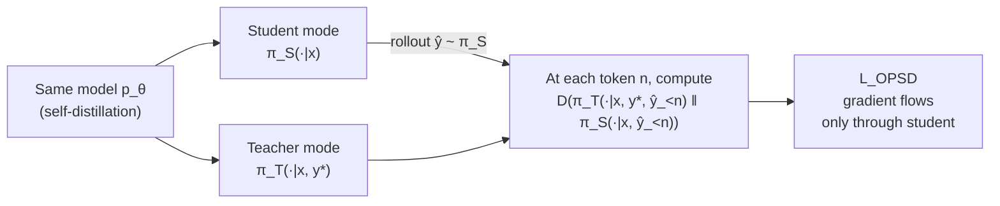
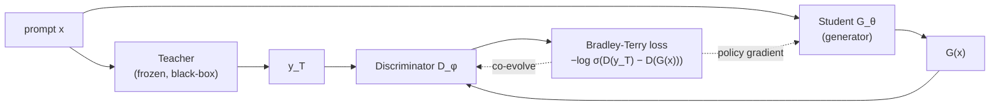

On-policy distillation (OPD): combining SFT's dense supervision with RL's on-policy property, plus a tour of self-distillation works (OPSD, SDFT, SDPO, CRISP, ExOPD, GAD).


近期很多工作都在围绕 **On-Policy Distillation (OPD)** 展开。它的核心定位很清晰：**在 student 自己采样出来的轨迹上，用 teacher 给每个 token 提供密集监督**——既保留 Supervised Fine-Tuning (SFT) 的 token-level dense signal，又拿到 Reinforcement Learning (RL) 的 on-policy 训推一致性。这篇 blog 顺着 SFT / RL 的互补缺陷出发，把 OPD 的两个数学版本写清楚，再展开六个 self-distillation 方向的代表工作。

延续前面两篇 blog 的脉络：5 号 [《KL Divergence》](./5-KL-Divergence.md) 已经把 forward / reverse KL 在 distillation 里"局部 vs 全局"的二象性讲过；6 号 [《损失函数推导》](./6-Loss-Functions.md) 把 KL 作为 loss 的位置定下来。这篇是它们在**蒸馏方法**上的具体落地。

---

## 0) 重点速览

* **OPD = student 产生 rollout（on-policy）+ teacher 给每个 token 的 logits 做监督（dense）**。
* **Self-Distillation** 用同一个模型同时做 teacher 和 student（条件不同），绕开"tokenizer 不一致"和"teacher 上限"两个工程问题。
* **On-Policy Self-Distillation (OPSD)** 在数学推理上 token 效率比 Group Relative Policy Optimization (GRPO) 高一个数量级，100 步内超过 GRPO 最终性能。
* **CRISP** 用 self-distillation 做推理压缩，token 数砍半还能让准确率反升——证实长 Chain-of-Thought (CoT) 里有大量"有害冗余"。
* **ExOPD** (OPD with reward extrapolation) 用一个 reward 放大系数 $\lambda$ 实现 reward extrapolation，理论上让 student 有可能超过 teacher。

---

## 1) 背景：SFT 和 RL 各自的缺陷

### 1.1 SFT：dense 但 off-policy

蒸馏 / 模仿学习里最朴素的 SFT，给定 (input, expert output) 数据对，做 token-level 交叉熵：

$$
\mathcal{L}_{\text{SFT}}(\theta)
=
-\mathbb{E}_{(x, y^*) \sim \mathcal{D}}
\left[
\sum_{t=1}^{|y^*|}
\log \pi_\theta(y_t^* \mid x, y_{<t}^*)
\right]
$$

* $x$ 是 prompt，$y^*$ 是专家答案，$\mathcal{D}$ 是数据集。
* 每个 token $y_t^*$ 都被直接监督——这是 SFT 的最大优点：**信号密集、训练高效**。

但 SFT 是 **off-policy** 的：训练时 model 看到的上下文 $y_{<t}^*$ 来自专家轨迹，而推理时它面对的是自己生成的 $\hat y_{<t}$，二者分布不一致——经典的 **exposure bias**。一旦推理时走出训练分布，模型很容易越走越歪。

### 1.2 RL：on-policy 但稀疏

RL（如 Proximal Policy Optimization (PPO) / GRPO，参见 3 号 [PPO](./3-PPO.md)、4 号 [GRPO](./4-GRPO.md)）正好相反：

* **训推一致**：训练时见的就是自己 rollout 出来的轨迹。
* **缓解灾难性遗忘**：目标是"强化自身已有的好行为"，而不是强行拟合一个新分布，对内在知识破坏小。

代价是**监督信号极稀疏**：一整条轨迹 rollout 完了，只回收一个 scalar reward。GRPO 用组内相对 advantage 缓解了一部分方差问题，但 token-level 仍然没有 dense supervision。

### 1.3 OPD：on-policy + dense

OPD 把两边的好处拼起来：

1. 由 **student 自己 rollout** 样本（拿到 on-policy 性质）。
2. **teacher 在每个 token 位置** 给出 logit 分布。
3. 在 student 的 rollout 上对每一个 token 拉近 student 与 teacher 的分布（拿到 dense supervision）。

放在同一根时间轴上对比三者的"上下文来源"和"per-token 监督信号"：

```
   position:        t=1   t=2   t=3   t=4   ...   t=T

   SFT          ┌─────┬─────┬─────┬─────┬─────┬─────┐
    context  →  │ y*  │ y*  │ y*  │ y*  │ ... │ y*  │   off-policy（teacher trajectory）
    signal   →  │ CE  │ CE  │ CE  │ CE  │ ... │ CE  │   dense: label y*_t at every step
                └─────┴─────┴─────┴─────┴─────┴─────┘

   RL           ┌─────┬─────┬─────┬─────┬─────┬─────┐
    context  →  │  ŷ  │  ŷ  │  ŷ  │  ŷ  │ ... │  ŷ  │   on-policy（student rollout）
    signal   →  │  ·  │  ·  │  ·  │  ·  │ ... │  r  │   sparse: one scalar at end
                └─────┴─────┴─────┴─────┴─────┴─────┘

   OPD          ┌─────┬─────┬─────┬─────┬─────┬─────┐
    context  →  │  ŷ  │  ŷ  │  ŷ  │  ŷ  │ ... │  ŷ  │   on-policy（student rollout）
    signal   →  │ π_T │ π_T │ π_T │ π_T │ ... │ π_T │   dense: teacher distribution per step
                └─────┴─────┴─────┴─────┴─────┴─────┘
```

> OPD 的本质：在 student 自己生成的轨迹上做 token-level 知识蒸馏——**上下文用 RL 那一行，监督用 SFT 那一行**。

---

## 2) On-Policy Distillation 的两种数学形式

### 2.1 Sampled-token 版本（Reverse KL 的 Monte Carlo (MC) 估计）

按照 Thinking Machines Lab 的实现，OPD 在序列级别等价于 student 与 teacher 之间的 **reverse Kullback-Leibler (KL) 散度**：

$$
\mathcal{L}_{\text{OPD}}(\theta)
=
D_{\mathrm{KL}}(\pi_\theta \,\|\, \pi_T)
=
\mathbb{E}_{y \sim \pi_\theta(\cdot \mid x)}
\left[
\log \pi_\theta(y \mid x) - \log \pi_T(y \mid x)
\right]
$$

* $\pi_\theta$ 是 student（要训练），$\pi_T$ 是 teacher（冻结）。
* $y \sim \pi_\theta$ 给出 on-policy 性质。

利用自回归分解，把序列级 KL 写成 token 级求和：

$$
\boxed{
\mathcal{L}_{\text{OPD}}(\theta)
=
\mathbb{E}_{y \sim \pi_\theta(\cdot \mid x)}
\left[
\sum_{t=1}^{|y|}
\bigl(
\log \pi_\theta(y_t \mid x, y_{<t})
-
\log \pi_T(y_t \mid x, y_{<t})
\bigr)
\right]
}
$$

实操：先用 $\pi_\theta$ 采样一条轨迹 $y$，再逐 token 算两边 log-prob 的差，求和后下降。**每个位置只用了被采样到的那一个 token**。

**为什么用 reverse KL 而不是 forward KL？** MiniLLM 给出的论点：

* Forward KL $D_{\mathrm{KL}}(\pi_T \| \pi_\theta)$ 是 mode-covering 的，会强迫 student 覆盖 teacher 所有高概率区域，连边缘 mode 都不能漏；表达力不够时容易把概率铺到低质量区域。
* Reverse KL $D_{\mathrm{KL}}(\pi_\theta \| \pi_T)$ 是 mode-seeking 的，student 只需专注 teacher 最集中的高质量模式。

（这正好是 5 号 [KL Divergence](./5-KL-Divergence.md) 第 5–8 节那套 mode-covering / mode-seeking 直觉的应用。）

Generalized Knowledge Distillation (GKD) 把这一点系统化，提供了 forward / reverse / Jensen-Shannon Divergence (JSD) 的统一框架。

### 2.2 Full-vocabulary 版本（Forward KL，方差更低）

采样版只利用了被采样到的那一个 token 的信息，**信噪比低、梯度方差大**。一个常见改进：在每个 token 位置对整个词表 $\mathcal{V}$ 做 KL，用 teacher 的概率作为权重：

$$
\boxed{
\mathcal{L}_{\text{full}}(\theta)
=
\mathbb{E}_{y \sim \pi_\theta(\cdot \mid x)}
\left[
\sum_{t=1}^{|y|}
\sum_{v \in \mathcal{V}}
\pi_T(v \mid x, y_{<t})
\log
\frac{\pi_T(v \mid x, y_{<t})}{\pi_\theta(v \mid x, y_{<t})}
\right]
}
$$

* 外层期望仍然来自 $\pi_\theta$ 的 rollout（on-policy 不变）。
* 内层是每个位置上的 $D_{\mathrm{KL}}(\pi_T \,\|\, \pi_\theta)$，**这是 forward KL**。

注意一个容易混淆的对比：

| 版本 | per-token loss | 直觉 |
|---|---|---|
| Sampled-token | reverse KL 的 MC 估计 | 只看被采到的那个 token |
| Full-vocabulary | forward KL（teacher 权重） | 每个位置看完整词表 |

> 上下文是 student rollout（on-policy 不变），但**位置上的 KL 方向**可以是 forward 也可以是 reverse——这正是 5 号 blog 里"局部 KL 方向 vs 全局采样分布"二象性的具体体现。

OPSD 的消融实验里 forward KL（full-vocab）效果最好，主要原因就是方差低。

### 2.3 从 OPD 到 Self-Distillation

朴素 OPD 在工程上有两个痛点：

1. **Teacher 难找**：拿一个更大的开源模型当 teacher（如用 Qwen3-70B 蒸馏 Qwen3-8B）会撞上 tokenizer 不对齐——OPD 要求 teacher / student 词表完全一致才能逐位置对齐 logits。
2. **Teacher 是上限**：student 最多趋近 teacher，蒸出来的能力天花板就是 teacher。

最近一类工作的解决方案：**self-distillation**——同一个模型既当 teacher 又当 student，区别只是**条件信息不同**。

* Teacher 看到额外的辅助信息 $c$（如专家答案、文本反馈、"be concise" 指令），生成质量更高的 soft label：

  $$\pi_T(\cdot \mid x, c) \triangleq p_\theta(\cdot \mid x, c)$$

* Student 只看原问题 $x$，正常 rollout：

  $$\pi_S(\cdot \mid x) \triangleq p_\theta(\cdot \mid x)$$

* Tokenizer 天然一致；teacher 的能力上限可以通过"加什么条件"来调。

> Self-distillation 的本质：**用专家信息把模型自己的 rollout 改写成一个"更好版的自己"，再让没有专家信息的自己去对齐它**。

---

## 3) Self-Distillation 代表工作

### 3.1 OPSD：Self-Distilled Reasoner

> Self-Distilled Reasoner: On-Policy Self-Distillation for Large Language Models · `siyan-zhao/OPSD`

**动机**：传统 RL（GRPO）在数学推理上 token 效率极低。

**做法**：让同一个模型在"看到答案"时做 teacher 生成 soft label，在"没看到答案"时做 student 生成 rollout，然后在 student 的 rollout 上做 full-vocab KL 蒸馏。

定义：

$$
p_T(\cdot \mid x, y^*) \triangleq p_\theta(\cdot \mid x, y^*),
\quad
p_S(\cdot \mid x) \triangleq p_\theta(\cdot \mid x)
$$

完整 loss：

$$
\mathcal{L}_{\text{OPSD}}(\theta)
=
\mathbb{E}_{(x, y^*) \sim \mathcal{S}}
\left[
\mathbb{E}_{\hat y \sim p_S(\cdot \mid x)}
\left[
\frac{1}{|\hat y|}
\sum_{n=1}^{|\hat y|}
D\bigl(
p_T(\cdot \mid x, y^*, \hat y_{<n})
\,\|\,
p_S(\cdot \mid x, \hat y_{<n})
\bigr)
\right]
\right]
$$

* $\mathcal{S} = \{(x_i, y_i^*)\}$ 是带标注的推理数据集（如数学题 + 标准答案）。
* $\hat y \sim p_S(\cdot \mid x)$ 表示 student（不看答案）做 rollout，得到上下文。
* 每个 token 位置 $n$，teacher 以 $(x, y^*, \hat y_{<n})$ 为条件，student 以 $(x, \hat y_{<n})$ 为条件，对齐两者的 next-token 分布。
* $D(\cdot \| \cdot)$ 可选 forward / reverse KL / JSD，实验里 **forward KL 最好**。

整体数据流：



**Per-token clipping** 用来防止某些 token（如标点、语气词）的 KL 值过大主导梯度：

$$
D_{\text{clip}}
=
\frac{1}{|\hat y|}
\sum_{n=1}^{|\hat y|}
\sum_{v \in \mathcal{V}}
\min(\ell_{n,v}, \tau),
\quad
\ell_{n,v}
=
p_T(v\mid\cdot)\log\frac{p_T(v\mid\cdot)}{p_S(v\mid\cdot)}
$$

**结果**：在数学推理上 token 效率比 GRPO 高约 10x，100 步内即可超过 GRPO 的最终性能。

### 3.2 Self-Distillation Fine-Tuning (SDFT)：治灾难性遗忘

> Self-Distillation Enables Continual Learning

和 OPSD 几乎完全相同的 self-distillation 框架，但出发点不同：**持续学习**中学新任务时旧知识被灾难性遗忘。

* Teacher：$\pi_T(\cdot \mid x, c) = p_\theta(\cdot \mid x, c)$，$c$ 是新任务的演示（demonstration）。
* Student：在新任务的 prompt $x$ 上做 on-policy rollout 并向 teacher 对齐。

实验结论："consistently outperforms SFT, achieving higher new-task accuracy while substantially reducing catastrophic forgetting"——新任务学得更好，旧任务遗忘得更少。

> 直觉：on-policy 学习不是强行拟合一个新分布，而是在自己的 rollout 上做改进，对内在知识破坏极小。这一性质和 RL 在遗忘问题上的优势是一脉相承的。

### 3.3 Self-Distillation Policy Optimization (SDPO)：用文本反馈作 teacher 条件

> Reinforcement Learning via Self-Distillation

Self-distillation 中 teacher 的辅助信息 $c$ **不必是 ground-truth**——任何能让 teacher 生成更好的"东西"都行。SDPO 把它换成**文本反馈** $f$（如"上一次第三步算错了"、单元测试报错等）：

$$
\pi_T(\cdot \mid x, f) = p_\theta(\cdot \mid x, f)
$$

Teacher 看到反馈后能纠错并生成更准的 soft label，student 在没看到反馈的 rollout 上学习。本质是用 feedback **拉大师生差距**，让蒸馏信号更有信息量。在代码 / 数学这种 verifiable feedback 场景对标 GRPO。

### 3.4 CRISP：Self-Distillation 做推理压缩

> CRISP: Compressed Reasoning via Iterative Self-Policy Distillation

**动机**：DeepSeek-R1、Qwen3-thinking 这类推理模型 CoT 越来越长，但里面有大量冗余甚至有害的 token——直接用 RL 做"短且对"很难，长度和准确率的 tradeoff 不容易写成 scalar reward。

**做法**：teacher 加一句 "be concise" 的指令，student 不加，按标准 OPD 做：

$$
\pi_T(\cdot \mid x, \text{be concise}) = p_\theta(\cdot \mid x, \text{be concise}),
\quad
\pi_S(\cdot \mid x) = p_\theta(\cdot \mid x)
$$

$$
\mathcal{L}_{\text{CRISP}}(\theta)
=
\mathbb{E}_{x \sim \mathcal{D}}
\left[
\mathbb{E}_{\hat y \sim \pi_S(\cdot \mid x)}
\left[
\sum_{t=1}^{|\hat y|}
D_{\mathrm{KL}}\!\bigl(
\pi_T(\cdot \mid x, \text{be concise}, \hat y_{<t})
\,\|\,
\pi_S(\cdot \mid x, \hat y_{<t})
\bigr)
\right]
\right]
$$

值得注意的是 **不需要 ground-truth 答案**——光靠"be concise"这一句指令就够了。结果不只是 token 数下降，准确率反而提升：

| Method | MATH-500 Acc | Len | Red. | AIME 2024 Acc | Len | Red. | AIME 2025 Acc | Len | Red. | MMLU Acc |
|---|---|---|---|---|---|---|---|---|---|---|
| **Qwen3-8B** | | | | | | | | | | |
| Base | 77.7 | 4,661 | — | 72.5 | 14,170 | — | 62.5 | 16,682 | — | 73.2 |
| Concise prompt | 80.9 | 2,941 | 36.9% | 67.5 | 11,589 | 18.2% | 56.3 | 14,347 | 14.0% | — |
| CRISP | **86.6** | **1,921** | **58.8%** | 69.6 | 9,152 | 35.4% | 57.1 | 10,726 | 35.7% | 73.3 |
| **Qwen3-14B** | | | | | | | | | | |
| Base | 70.0 | 3,872 | — | 65.8 | 12,884 | — | 67.1 | 15,642 | — | 76.9 |
| Concise prompt | 83.8 | 2,429 | 37.3% | 64.9 | 9,866 | 23.4% | 53.8 | 12,831 | 18.0% | — |
| CRISP | **86.1** | **1,686** | **56.5%** | **76.3** | 7,577 | 41.0% | 61.7 | 10,137 | 35.2% | 76.9 |

> 这反过来说明：长 CoT 里确实存在大量**有害冗余**，把它们压掉之后噪声更少，准确率不降反升。

### 3.5 ExOPD / G-OPD：让 student 有可能超过 teacher

> Learning beyond Teacher: Generalized On-Policy Distillation with Reward Extrapolation

标准 OPD 框架下 student 的能力上限就是 teacher。Generalized On-Policy Distillation (G-OPD) 引入一个 reward 缩放系数 $\lambda$：

$$
\mathcal{L}_{\text{G-OPD}}(\theta)
=
\mathbb{E}_{y \sim \pi_\theta}
\left[
\sum_t
\Bigl(
\lambda \log \pi_T(y_t \mid x, y_{<t})
-
\log \frac{\pi_\theta(y_t \mid x, y_{<t})}{\pi_{\text{ref}}(y_t \mid x, y_{<t})}
\Bigr)
\right]
$$

* $\lambda = 1$ 且 $\pi_{\text{ref}}$ 取均匀分布时严格退化为标准 OPD；实际中 $\pi_{\text{ref}}$ 多取 student 初始策略（类似 Reinforcement Learning from Human Feedback (RLHF) / Direct Preference Optimization (DPO) 的 KL 正则）。
* $\lambda > 1$ 时 teacher 的 reward 权重被放大，鼓励 student 在 teacher 信号上**外推**——这就是 ExOPD（reward extrapolation）。

**强弱蒸馏场景的 reward correction**：把大模型的 RL 后版本当作 $\pi_{\text{ref}}$ 会引入风格偏差；G-OPD 建议改用大模型的 pre-training base 版作为 $\pi_{\text{ref}}$，得到更准的 reward 信号。

### 3.6 Generative Adversarial Distillation (GAD)：黑盒 OPD（拿不到 logits 的场景）

> Black-Box On-Policy Distillation of Large Language Models · `microsoft/gad`

**动机**：GPT-4 / Claude 这种 Application Programming Interface (API) teacher 拿不到 logits，前面所有"对齐 token 分布"的方法都用不上。

**做法**：用 **对抗训练** 替代 logit 对齐：

* Student 当 generator，根据 prompt 生成回复。
* Discriminator 判断回复是 student 生成的还是 teacher 生成的。
* Student 优化目标是让 discriminator 分不清——逼近 teacher 风格。
* 关键设计：**discriminator 与 student 联合演化**（co-evolve），始终给出 on-policy 的自适应反馈，避免 Generative Adversarial Network (GAN) 训练里 discriminator 被甩开的常见问题。

整体数据流：



损失采用 Bradley-Terry 形式：

$$
\mathcal{L}
=
-\log \sigma\bigl(D(y_T) - D(G(x))\bigr)
$$

其中 $D(\cdot)$ 是 discriminator 打分，$y_T$ 是 teacher 输出，$G(x)$ 是 student 输出。

> 其他几种方法都靠对齐 token 分布；GAD 把"对齐"换成"骗过判别器"，是 OPD 在 black-box 场景的唯一可行路线。

---

## 4) 一张图：六篇工作怎么放在同一个框架下

所有 self-distillation 工作都共享同一个骨架：teacher 加额外条件 $c$、student 不加 $c$、在 student 的 rollout 上做 OPD。差别只在 $c$ 是什么、loss 形式怎么扩展：

| 方法 | Teacher 条件 $c$ | 关键改造 | 解决的问题 |
|---|---|---|---|
| OPSD | ground-truth $y^*$ | full-vocab forward KL + per-token clip | RL token 效率低 |
| SDFT | demonstration $c$ | 与 OPSD 同框架 | 持续学习中的灾难性遗忘 |
| SDPO | 文本反馈 $f$ | 用 verifier 输出当条件 | RL 信号稀疏 |
| CRISP | "be concise" 指令 | 无 ground-truth | 推理 CoT 冗余 |
| ExOPD | （无新条件，调 $\lambda$） | reward extrapolation + $\pi_{\text{ref}}$ 校正 | student 能力受限于 teacher |
| GAD   | （teacher 是 black-box） | 对抗训练替代 logit 对齐 | 拿不到 teacher logits |

---

## 5) 一句话总结

OPD 把 SFT 的 dense token-level supervision 与 RL 的 on-policy 训推一致性拼在一起——**student 自己采样、teacher 在每个位置打 soft label**——self-distillation 则进一步把 teacher 换成"加了条件的自己"，从而绕开 tokenizer / 上限两个工程瓶颈，并衍生出推理压缩、持续学习、reward 外推、黑盒蒸馏等一系列变体。

> 把这条线和前面几篇 blog 拼起来：6 号告诉你 KL 是怎么从 NLL 落到 loss 的；5 号告诉你 forward / reverse KL 在蒸馏里"局部 vs 全局"的二象性；本篇把它具体落地到了"student 自己 rollout，teacher 给 token-level 监督"这一套训练范式。
