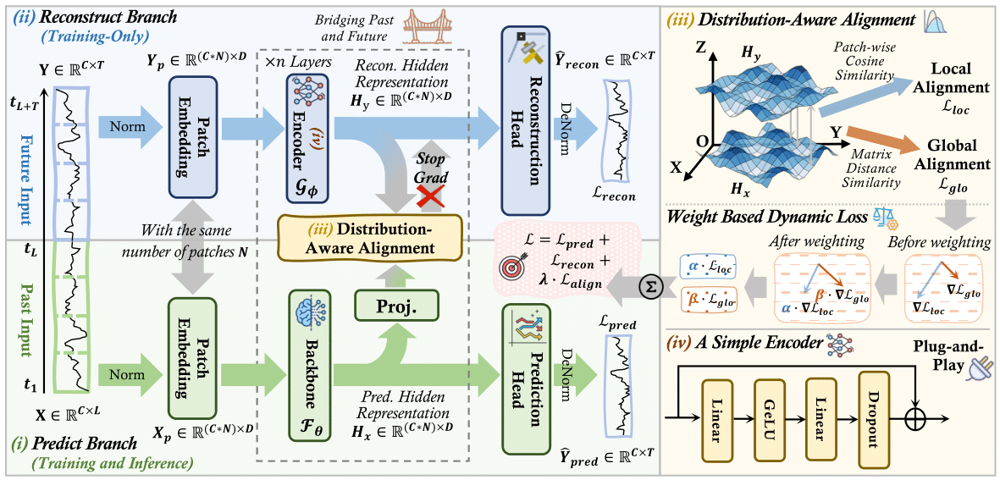
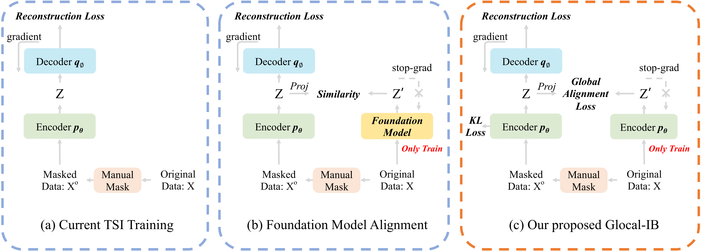
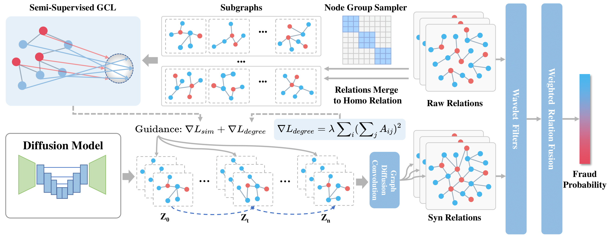

Hi! I am a 25Fall Ph.D. student in Computer Science at [the University of Illinois Chicago (UIC)](https://www.uic.edu/). Previously, I was a research intern at [Northwestern University](https://www.northwestern.edu/), where I worked closely with Prof. [Kaize Ding](https://scholar.google.com/citations?user=PI3myr8AAAAJ&hl=en&oi=ao). I received my B.E. in Computer Science from [Tongji University](https://www.tongji.edu.cn/), working closely with [Dawei Cheng](https://scholar.google.com/citations?user=4UD20ukAAAAJ&hl=en).

My research interests focus on:

- **LLM Agents**
- **Time Series Forecasting/Imputation**
- **Graph Anomaly Detection**

<!-- Link: [CV](../files/pdf/CV_JieYang.pdf "CV_JieYang") -->

## 📧 Contact

Email: jyang265[at]uic[dot]edu

## 🔥 News
- *2025.09*: 🎉🎉 One paper is accepted by NeurIPS 2025!
- *2025.01*: 🎉🎉 One paper is accepted by WWW 2025!

## 📝 Publications

Notes:（*）indicates the equal contributions.

ICLR, 2026

Bridging Past and Future: Distribution-Aware Alignment for Time Series Forecasting

Yifan Hu*, **Jie Yang***, Tian Zhou, Peiyuan Liu, Yujin Tang, Rong Jin, Liang Sun

[ **Paper**](https://arxiv.org/pdf/2509.14181)   [**Code**](https://github.com/TROUBADOUR000/TimeAlign)

NeurIPS, 2025

Glocal Information Bottleneck for Time Series Imputation

**Jie Yang**, Kexin Zhang, Guibin Zhang, Philip S. Yu, Kaize Ding

[**Paper**](https://neurips.cc/virtual/2025/poster/116239)  [**Arxiv**](https://arxiv.org/pdf/2510.04910)   [**Code**](https://github.com/Muyiiiii/NeurIPS-25-Glocal-IB)

WWW, 2025

Grad: Guided Relation Diffusion Generation for Graph Augmentation in Graph Fraud Detection

**Jie Yang**, Rui Zhang, Ziyang Cheng, Dawei Cheng, Guang Yang, Bo Wang

[ **Paper**](https://dl.acm.org/doi/10.1145/3696410.3714520)   [**Code**](https://github.com/Muyiiiii/WWW25-Grad)

## 📖 Educations

- 2025.09-2030.06 (*expected*), Ph.D. in Computer Science,  **University of Illinois Chicago**
- 2021.09- 2025.06, Bachelor in Computer Science, **Tongji University**

## 🔗 Service

- Conference Reviewer
  - 2026: ICLR
 

