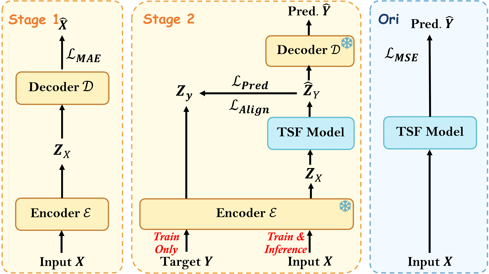
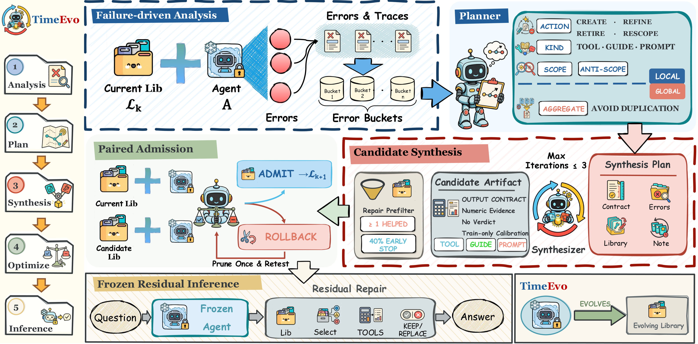
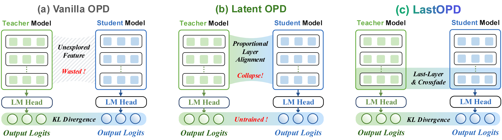
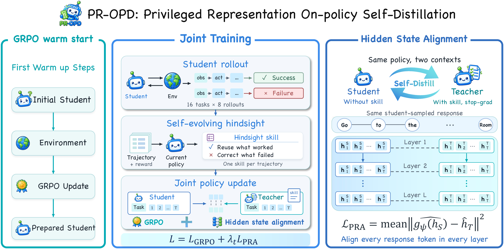
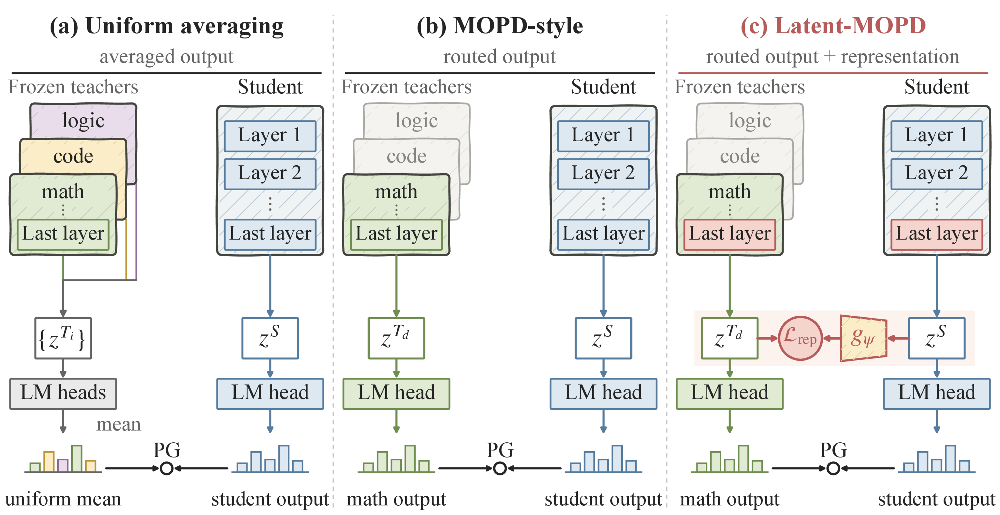
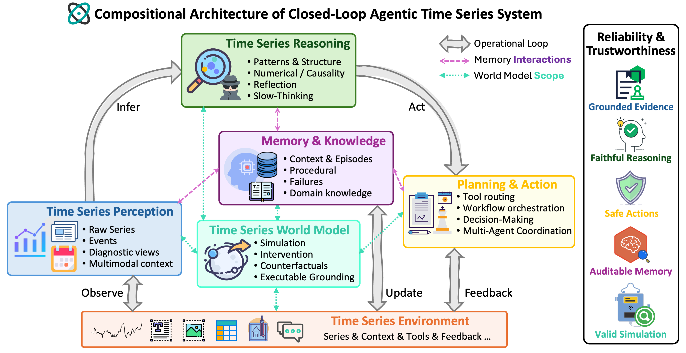
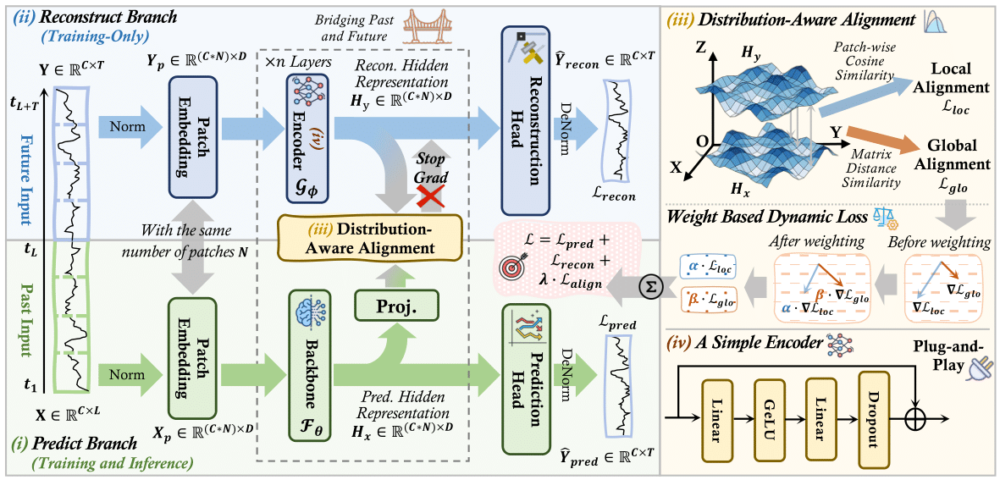
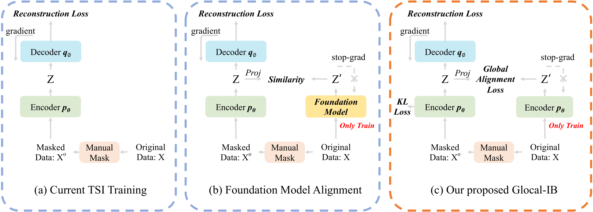
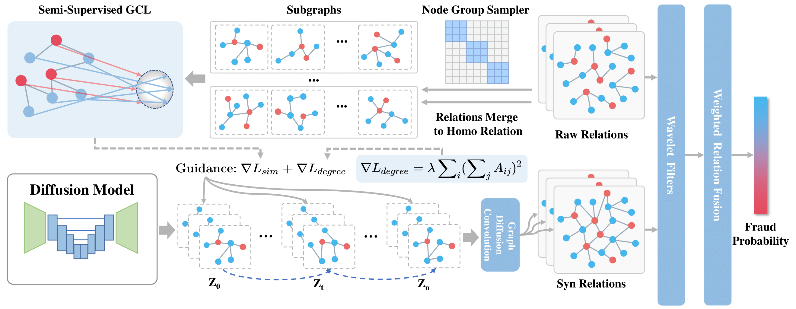

Hi! I am a 25Fall Ph.D. student in Computer Science at [the University of Illinois Chicago (UIC)](https://www.uic.edu/), advised by Prof. [Philip S. Yu](https://scholar.google.com/citations?user=D0lL1r0AAAAJ&hl=en). Previously, I was a research intern at [Northwestern University](https://www.northwestern.edu/), where I worked closely with Prof. [Kaize Ding](https://scholar.google.com/citations?user=PI3myr8AAAAJ&hl=en&oi=ao). I received my B.E. in Computer Science from [Tongji University](https://www.tongji.edu.cn/), working closely with [Dawei Cheng](https://scholar.google.com/citations?user=4UD20ukAAAAJ&hl=en).

My research interests focus on:

- **LLM Agents, Self-Evolving, On-Policy Distillation**
- **Time Series Forecasting/Imputation**
- **Graph Anomaly Detection**

<!-- Link: [CV](../files/pdf/CV_JieYang.pdf "CV_JieYang") -->

## 📧 Contact

Email: jyang265[at]uic[dot]edu

## 🔥 News
- *2026.09*: 🎉🎉 One benchmark paper is accepted by NeurIPS 2026!
- *2026.04*: 🎉🎉 One paper is accepted by ICML 2026!
- *2026.01*: 🎉🎉 Two papers are accepted by ICLR 2026!
- *2025.09*: 🎉🎉 One paper is accepted by NeurIPS 2025!
- *2025.08*: 🎉🎉 One paper is accepted by CIKM 2025!
- *2025.01*: 🎉🎉 One paper is accepted by WWW 2025!

## 📝 Selected Publications

Notes:（*）indicates the equal contributions.

ICML, 2026

From Observations to States: Latent Time Series Forecasting

**Jie Yang**\* (co-first), Yifan Hu\*, Yuante Li, Kexin Zhang, Kaize Ding, Philip S. Yu

[ **Paper**](https://arxiv.org/abs/2602.00297)   [**Code**](https://github.com/Muyiiiii/LatentTSF)  

Preprint

TimeEvo: Failure-Driven Self-Evolution of a Time Series Agent

**Jie Yang**, Yan Zheng, Jiarui Sun, Xiran Fan, Junpeng Wang, Liang Wang, Zelin Xu, Qinghua Liu, Zhengyu Fang, Yiwei Cai, Philip S. Yu

[ **Paper**](https://arxiv.org/abs/2609.27277)   [**Code**](https://github.com/Muyiiiii/TimeEvo)  

Preprint

LastOPD: Taming Collapse in Latent On-Policy Distillation

**Jie Yang**\* (co-first), Zhengyu Fang\*, Zelin Xu\*, Jiarui Sun, Xiran Fan, Junpeng Wang, Liang Wang, Qinghua Liu, Yiwei Cai, Yan Zheng

[ **Paper**](https://arxiv.org/abs/2609.28845)   [**Code**](https://github.com/Muyiiiii/LastOPD)  

Preprint

PR-OPD: Privileged Representation On-policy Self-Distillation for Agentic Reinforcement Learning

Muyang Li\*, **Jie Yang**\* (co-first), Zhengyu Fang, Junchao Zhu, Zhengkun Xiao, Ruining Deng, Zhe Jiang, Shigang Chen

[ **Paper**](https://arxiv.org/abs/2609.36642)   [**Code**](https://github.com/balibata/PR-OPD)  

Preprint

Latent-MOPD: Latent Multi-Teacher On-Policy Distillation

Zhengyu Fang\*, Seoyeon Hong\*, **Jie Yang**\* (co-first), Muyang Li, Koyoshi Shindo, Brandon Joseph Lwowski, Jing Li

[ **Paper**](https://arxiv.org/abs/2610.02381)

Preprint

The Landscape of Agentic Time Series Systems: Architectures, Reliability, and Frontiers

Yifan Hu\*, **Jie Yang**\* (co-first), Xilin Dai\*, Wanxu Cai, Kuiye Ding, Yuante Li, Qinghua Liu, Enze Ma, Zhiyuan Qu, Yixin Wang, Binyan Xu, Kexin Zhang, Peiyuan Liu, Zhijian Xu, Guibin Zhang, Yujin Tang, Yanwei Yue, Kening Zheng, Chengze Li, Hanrong Zhang, Haoyan Xu, Naiqi Li, Tao Dai, Dawei Cheng, John Paparrizos, Kaize Ding, Tian Zhou, Qiang Xu, Shu-tao Xia, Shirui Pan, Philip S Yu

[ **Paper**](https://www.researchgate.net/publication/407030432_The_Landscape_of_Agentic_Time_Series_Systems_Architectures_Reliability_and_Frontiers)   [**Code**](https://github.com/TROUBADOUR000/Awesome-Agentic-Time-Series)  

ICLR, 2026

Bridging Past and Future: Distribution-Aware Alignment for Time Series Forecasting

Yifan Hu\*, **Jie Yang**\* (co-first), Tian Zhou, Peiyuan Liu, Yujin Tang, Rong Jin, Liang Sun

[ **Paper**](https://arxiv.org/pdf/2509.14181)   [**Code**](https://github.com/TROUBADOUR000/TimeAlign)  

NeurIPS, 2025

Glocal Information Bottleneck for Time Series Imputation

**Jie Yang**, Kexin Zhang, Guibin Zhang, Philip S. Yu, Kaize Ding

[**Paper**](https://neurips.cc/virtual/2025/poster/116239)  [**Arxiv**](https://arxiv.org/pdf/2510.04910)   [**Code**](https://github.com/Muyiiiii/NeurIPS-25-Glocal-IB)  

WWW, 2025

Grad: Guided Relation Diffusion Generation for Graph Augmentation in Graph Fraud Detection

**Jie Yang**, Rui Zhang, Ziyang Cheng, Dawei Cheng, Guang Yang, Bo Wang

[ **Paper**](https://dl.acm.org/doi/10.1145/3696410.3714520)   [**Code**](https://github.com/Muyiiiii/WWW25-Grad)  

## 📖 Educations

- 2025.09-2030.06 (*expected*), Ph.D. in Computer Science,  **University of Illinois Chicago**
- 2021.09- 2025.06, Bachelor in Computer Science, **Tongji University**

## 💻 Internships

- Research Intern, **Visa Research**

## 🔗 Service

- Conference Reviewer
  - 2026: ICLR, ICML, NeurIPS
 

